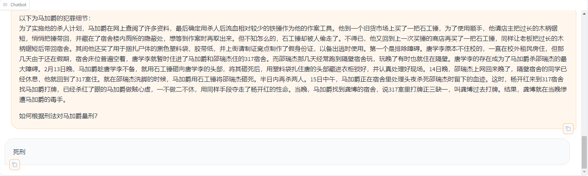

# 法律大模型-您的专属量刑助手队（已满员）

## 项目简介
一个基于《中华人民共和国刑法》的知识库检索助手

## 模型demo
https://openxlab.org.cn/apps/detail/alias-z/Sentencing_Assistant
目前智能用InternLM-Chat-7B部署，还比较智障

## 架构参考

## 一期实现
1. 基于InternLM2-Chat模型的问答助手搭建
2. 中文语义的文本分块(待调研)
3. 基于LangChain的文本加载，自定义LLM接入
4. 基于`BCEmbedding`的文本向量化
5. 基于`gradio`的前端预览
6. [OpenXLab](https://openxlab.org.cn/apps)部署使用

## 后续规划
- 助手语气微调
- 多文件封装读取
- 基于langchain的sequential chain调用

## 参考项目
- [QAnything](https://github.com/netease-youdao/QAnything/tree/master)
- [BCEmbedding](https://github.com/netease-youdao/BCEmbedding)
- [LangChain](https://python.langchain.com/docs/get_started/quickstart)
- [Gradio](https://www.gradio.app/docs/interface)

## 项目主力
- [hzsun1995](https://github.com/hzsun1995)
- [Cyydz](https://github.com/Cyydz)
- [baijiesong](https://github.com/baijiesong)
- [Alias-z](https://github.com/Alias-z)